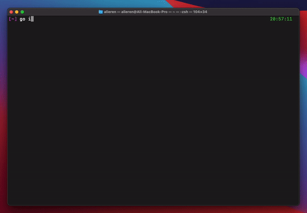

# Go Ekşisözlük CLI
<p align="center">
    <a href="https://pkg.go.dev/github.com/aliereno/eksisozluk-cli" target="_blank"></a>&nbsp;
    <a href="https://goreportcard.com/report/github.com/aliereno/eksisozluk-cli" target="_blank"></a>&nbsp;
    <a href="https://github.com/aliereno/eksisozluk-cli/blob/master/LICENSE" target="_blank"></a>
</p>

<div align="center">


</div>

## Install

```
go install github.com/aliereno/eksisozluk-cli@latest 
```


## License

[MIT](https://choosealicense.com/licenses/mit/)